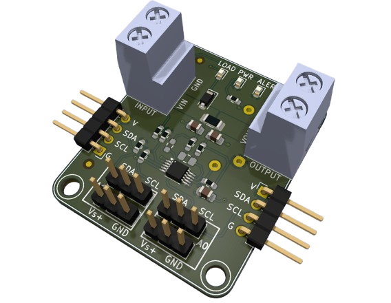
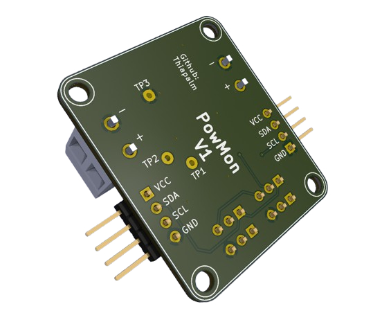
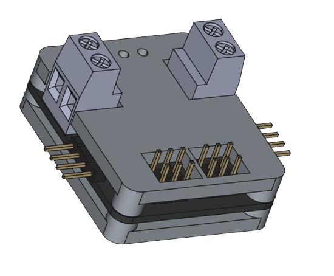
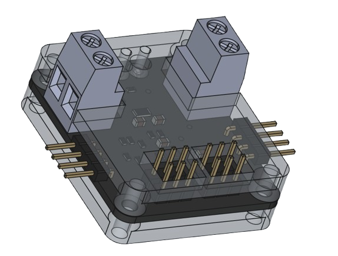

# (PowMon) Power Monitor Board

 
 

This is a hobby development board conceived for usage in my home lab. The device monitors both a shunt  voltage drop and bus supply voltage. Programmable calibration value, conversion times, and averaging,  combined with an internal multiplier, enable direct readouts of current in amperes and power in watts.

The board has 2 headers used for address configuration, allowing all 16 addresses to be used as you see fit. The board power is provided by the I²C connector, and it can be used in 5V or 3V3 modes. 

## License and certification

This is an open source hardware project licensed under CERN-OHL-P. More details on [LICENSE.md](./LICENSE.md).  

## Project

The PCB project was developed in Kicad 9, all necessary project files are available in this repository and can be used freely, according to License.

## Board specifications

The board is based on the [**INA226**](https://www.ti.com/lit/gpn/ina226) from Texas Instruments.  
Board features commonly used in Embedded Systems:
- Measure voltages from 0V up to 36V
- Configurable averaging options
- Reports current, voltage and power
- I²C serial communication (Two Headers for BUS usage)
- LED indicators (LOAD, Board POWER and ALERT)
- 2.7v up to 5v operation voltage from I²C header
- Board Address selector (A0 and A1)

## Board View 

## Board Enclosure 

There is an enclosure made in Freecad 1.0 available on the enclosure folder, it can be used or modified as you see fit. For best results I recommend to print in transparent filament. You will also need 4 M3 x 10mm screws (black with flat head are recommended).  

  

## Version Revision

V1 - current version  
   - Added two I²C headers so it can be used in a bus
   - Added Address configuration headers
   - Added informational LEDs

## Firmware

There is no specific firmware for this board, but i have a driver (crate) developed in RUST for INA226, see it in [crates.io](https://crates.io/crates/ina226-tp) or you can search the internet for a c/c++ version.

## Contribution

Unless you explicitly state otherwise, any contribution intentionally submitted for inclusion in the work by you, as defined in the CERN-OHL-P license, shall be licensed as above, without any additional terms or conditions.
